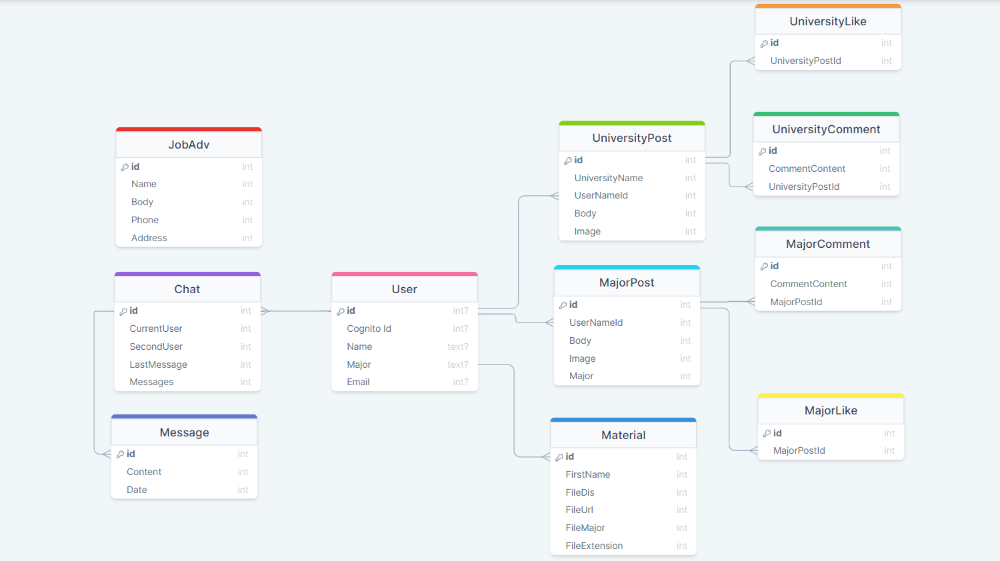

# SocialUniversity

For university students, our application will help them to communicate with their 
colleagues in the same department and the same university. and they can also find the
required resources to help them on their study and saving their time instead of spent their
time searching on these resources in different places. in addition, if any student 
Interested in finding a suitable job he can browse the job opportunities section to find
a suitable job if he want to work while he is studying or after his graduation.
the students can post or ask anything on the main channel or their department group to 
help each other and exchanging their Information.

___

#screenShots

## Wireframe

___

## Database Schema

___

## APK
[APK](App/app/build/outputs/apk/debug/app-debug.apk)

## APK
[APK](App/app/build/outputs/apk/debug/app-debug.apk)

___
## Project slides presentations
[slides](Social_university.pptx)
## Members

1. Wael Alqawasmi
2. Roaa Hailat
3. Motasem Alkilany
4. Mohammad Aladarbeh

___

# Stories

1. First Story :
    * As an UnAuthentication user, he can just to access for the login and signup Activites.
    * Feature task : 
        - Create new account.
        - login from his account.
        - Verify his account.
    * Acceptance Tests :
        - ensure that your username and password are correct.
        - ensure that your account is Verified.
2. Second Story : 
    * As an authentication user, he can to post anything he want inside the Same specialty group and the University group.
    * Feature task : 
        - create new post .
    * Acceptance Task : 
        - Ensure that the post render on the UI Thread.
3. Third Story : 
    * As an authentication user, he can post and apply to the job inside the job Page.
    * Feature task : 
        - post a job opportunities.
        - apply to a specific job.
    * Acceptance Task : 
        - ensure that the job Advertismint ender on the UI Thread.
4. Fourth Story : 
    * As an authentication user, he can to download and upload any material in the same major page he want it .
    * Feature task : 
        - Download files.
        - Upload files.
    * Acceptance Task : 
        - ensure that the file is upload on the material Page.
        - ensure that the file is download on his devise.
5. Fifth Story : 
    * As an Authentication user, he can communicate with any college in his University .
    * Feature TAsk : 
        - send and recive a message .
    * Acceptance Task : 
        - ensure that the message presesnt to the second user.

___

## installation
1. colon the project from github
2. cd to App
3. write this command 
> amplify init

